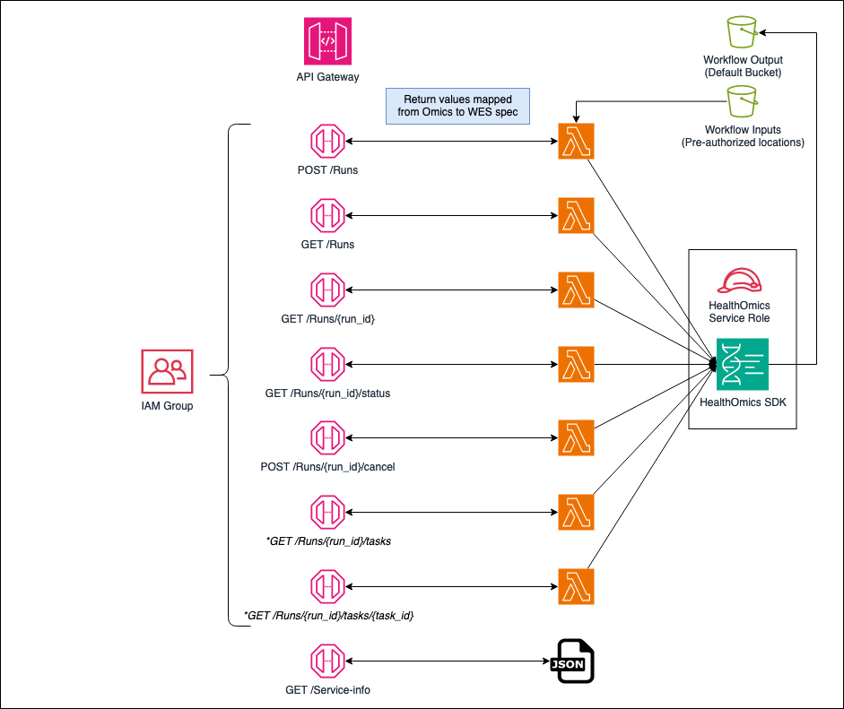

## GA4GH WES on AWS HealthOmics

GA4GH WES on AWS HealthOmics enables customers to use GA4GH WES with AWS HealthOmics Workflows. This allows easy migration for GA4GH WES applications to use the computing scale, predictable pricing, and built-in security and compliance provided by AWS HealthOmics Workflows.

AWS HealthOmics Workflows is a managed service that enables customers to run bioinformatics processing pipelines at scale on AWS. The Global Alliance for Genomics and Health (GA4GH) is a standards development organization promoting secure sharing and interoperability of genomic data and computational tooling. Workflow Execution Schema (WES) is one of several APIs developed by the GA4GH that provides a standard for submitting and monitoring bioinformatics workflows using distributed cloud computing. While aligned with the purpose of GA4GH WES, AWS HealthOmics Workflows implements its own APIs - optimized for use in AWS - to receive, execute, and monitor workflows. 

In order to migrate GA4GH WES compliant pipelines, this CDK package will deploy the required cloud infrastructure for a set of GA4GH WES endpoints integrated with Amazon Omics. The solution is self-hosted in a customer’s AWS account and code for the solution is open source. This allows customers to fully customize the solution to meet their specialized needs.

## Prerequisites

- Any inputs to your workflows need to reside in an existing S3 bucket. You can specify multiple input buckets in your configuration (see deployment instructions below for details).
- You will need an S3 bucket that can be used as a root location for any workflow outputs. This can be specified in your configuration (see deployment instructions below for details).
- This stack does not allow you to create workflows through the API. Workflows must exist and any tooling needs to be contained in a Docker image in your Private ECR.

## Deployment

To get started with this stack, follow these instructions...

1. Identify, or create, the necessary S3 buckets for storing inputs and outputs of your workflows.
2. Update the `lib/config/data-locations.json` file with the locations of these buckets.

Example of `lib/config/data-locations.json` file

```
{
    "output_bucket_uri": "<s3 bucket output uri>,
    "source_uris": [  "<s3 bucket source uri>",.. ]
}
```

3. Install and configure the AWS CDK tooling (https://docs.aws.amazon.com/cdk/v2/guide/getting_started.html)
4. Deploy the stack using `cdk deploy`
5. The stack will create an IAM groupcalled `omicsapiusers` to protect the endpoints. Add your IAM user(s) to this group so they can access the API.
6. Test the API. Here are some sample requests using cURL. Replace the endpoint URL's with the one that was returned from the stack deployment.

`curl 'https://{REPLACE-WITH-API-ID}.execute-api.us-east-1.amazonaws.com/prod/service-info'`

Secured using SigV4...
`curl 'https://{REPLACE-WITH-API-ID}.execute-api.us-east-1.amazonaws.com/prod/runs' --aws-sigv4 aws:amz:us-east-1:execute-api --user "${AWS_ACCESS_KEY_ID}:${AWS_SECRET_ACCESS_KEY}" --header "x-amz-security-token: ${AWS_SESSION_TOKEN}" `

## Stack

Summary of what the stack includes, along with a diagram of the endpoints:

* **API Gateway** - REST API on the Amazon API Gateway with endpoints for each of the WES API endpoints.
* **IAM** - A service role is created for accessing the HealthOmics SDK. This role will have access to whatever S3 buckets are defined in the `lib/config/data-locations.json` file.
* **Lambdas** - Each API endpoint is backed by a simple lambda function that passes the request to the HealthOmics SDK and returns the raw results from the SDK.
* **Velocity Templates** - Velocity templates are used to translate the results from the lambda into what the WES specification requires.
* **Auth** - API endpoints are restricted to IAM users that are part of the `omicsapiusers` IAM group. API requests need to be signed using SigV4 to identify the IAM user making the request (cURL example above).



> **Note**
>
> The POST /Runs endpoint requires the HTTP Body to be submitted as content-type=application/json.

## License Summary

This sample code is made available under the MIT-0 license. See the LICENSE file.
